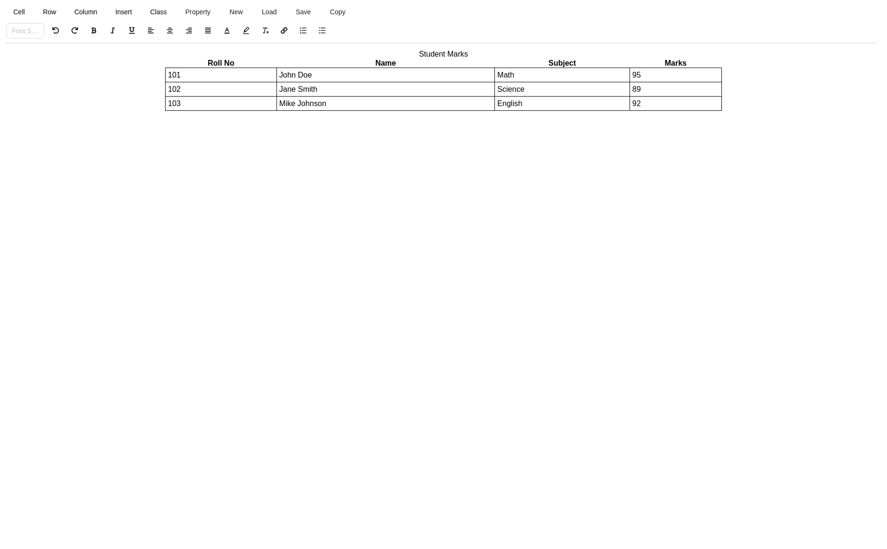

# 📊 HTML Table Generator

This is React based Project made with tailwind CSS and Antd UI to build HTML Table without any knowledge of code

---

## 📝 Features

-   Basic HTML table structure
-   Table headers and rows
-   Simple CSS styling (if any)
-   Responsive (optional if you've added media queries)
-   Clean and minimal design

---

## 🔧 Technologies Used

-   Next.js
-   Tailwind CSS

---

## 📸 Preview

